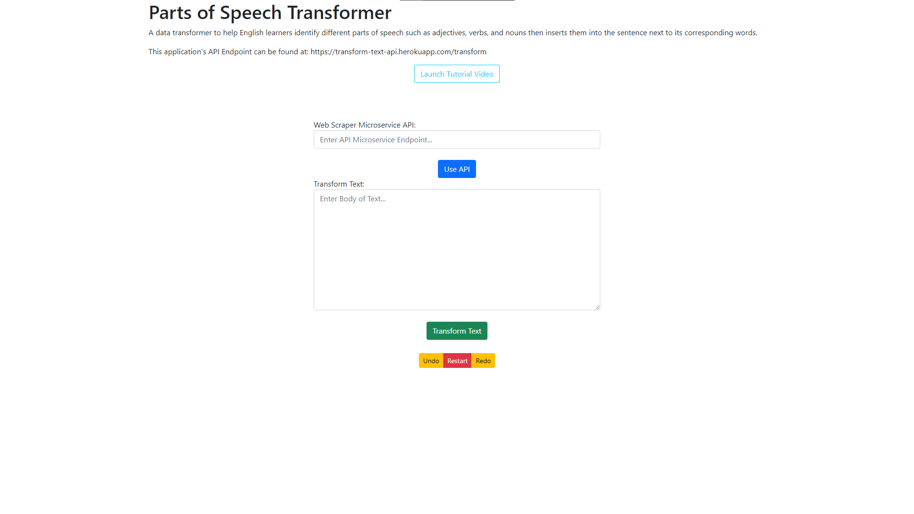

# Parts of Speech Transformer
 A data transformer to help English learners identify different parts of speech such as adjectives, verbs, and nouns then inserts them into the sentence next to its corresponding words. I created my own GUI for user interaction, my own web server API, and used a fellow teammate's API as well all based on the increasingly popular microservice architecture. We also used the Agile Scrum Methodology during project development as a team of five. This was the portfolio project of CS 361 Software Engineering I taught by Professor Lara Letaw at the Oregon State University in Spring Quarter 2021.

Visit the live Graphical User Interface (GUI) at: [sittiphat.github.io/CS-361-GUI](https://sittiphat.github.io/CS-361-GUI/)

